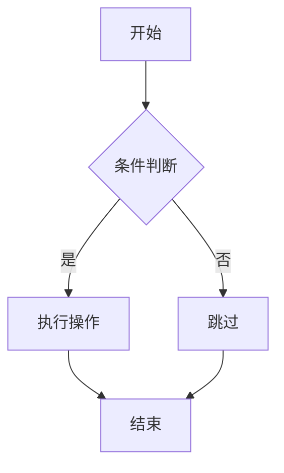
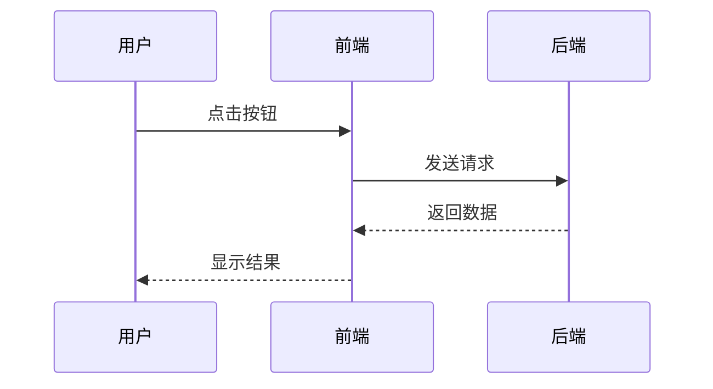
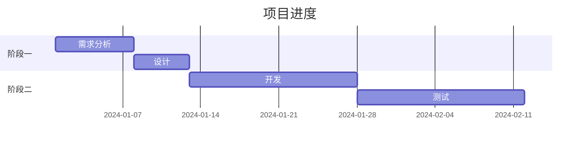
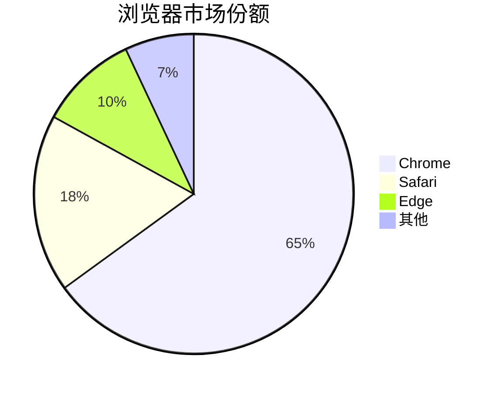
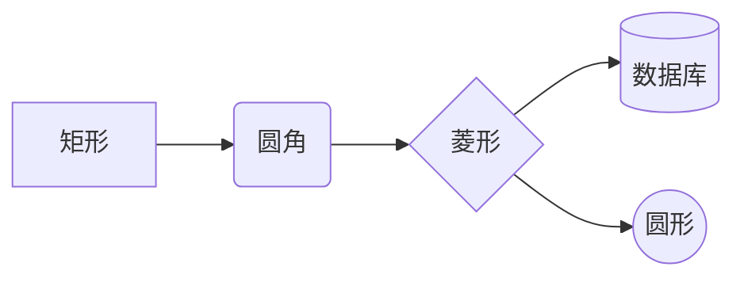

# Markdown 系统教程

> 从零基础到熟练编写技术文档的完整指南  
> 共 7 章 16 讲，遵循「基础 → 核心 → 进阶 → 实战」的渐进结构

---

## 课程总览

**预计讲数**：16 讲（7 章）  
**学习目标**：

1. 理解 Markdown 的设计哲学与工作原理
2. 熟练使用所有核心语法（标题、列表、链接、图片、代码、表格等）
3. 掌握 GFM（GitHub Flavored Markdown）扩展语法
4. 能够编写数学公式、Mermaid 流程图
5. 独立完成技术文档、README、博客文章等实战项目

**适合人群**：程序员、技术写作者、博主、学生及所有需要编写结构化文本的人

---

## 详细目录

- [第一章 基础入门](#第一章-基础入门)
  - [第1讲 什么是 Markdown](#第1讲-什么是-markdown)
  - [第2讲 标题与段落](#第2讲-标题与段落)
  - [第3讲 文本格式](#第3讲-文本格式)
- [第二章 列表与引用](#第二章-列表与引用)
  - [第4讲 列表语法](#第4讲-列表语法)
  - [第5讲 引用与嵌套](#第5讲-引用与嵌套)
- [第三章 链接与媒体](#第三章-链接与媒体)
  - [第6讲 链接](#第6讲-链接)
  - [第7讲 图片](#第7讲-图片)
- [第四章 代码与公式](#第四章-代码与公式)
  - [第8讲 代码块](#第8讲-代码块)
  - [第9讲 数学公式](#第9讲-数学公式)
- [第五章 表格与分隔线](#第五章-表格与分隔线)
  - [第10讲 表格](#第10讲-表格)
  - [第11讲 分隔线与转义](#第11讲-分隔线与转义)
- [第六章 进阶语法](#第六章-进阶语法)
  - [第12讲 脚注与定义](#第12讲-脚注与定义)
  - [第13讲 HTML 嵌入](#第13讲-html-嵌入)
  - [第14讲 Mermaid 图表](#第14讲-mermaid-图表)
- [第七章 实战应用](#第七章-实战应用)
  - [第15讲 方言与扩展](#第15讲-方言与扩展)
  - [第16讲 实战项目](#第16讲-实战项目)

---

# 第一章 基础入门

本章将带你认识 Markdown 的本质，掌握文档骨架（标题与段落）和最基本的文本格式。这是整个课程的基石，后续所有内容都建立在这些基础之上。

## 第1讲 什么是 Markdown

### 概念

Markdown 是一种**轻量级标记语言**（Lightweight Markup Language），由约翰·格鲁伯（John Gruber）和亚伦·斯沃茨（Aaron Swartz）于 2004 年共同创建。它的核心思想是：用**纯文本**格式编写文档，通过简单的符号标记格式，最终可以转换为结构化的 HTML（或其他格式）。

与 Word 这类「所见即所得」的富文本编辑器不同，Markdown 采用「所写即所得」的理念——你看到的源码就是最终格式的基础，没有任何隐藏的样式信息。

### 原理

Markdown 的工作机制可以概括为三步：

1. **编写**：用户使用纯文本编辑器（如 VS Code、Typora）编写 `.md` 文件，用特定符号表示格式
2. **解析**：Markdown 解析器（parser）读取源文件，将符号转换为对应的 HTML 标签
3. **渲染**：浏览器或渲染引擎显示 HTML，呈现最终效果

例如，你在源文件中写 `**加粗**`，解析器会将其转换为 `<strong>加粗</strong>`，浏览器渲染后显示为 **加粗**。

Markdown 之所以流行，原因有三：第一，**纯文本特性**使其可以用任何编辑器打开，不依赖特定软件；第二，**版本控制友好**，Git 等工具可以清晰追踪每一行的变化；第三，**可移植性强**，同一份源文件可转换为 HTML、PDF、Word 等多种格式。

### 例子

一个最简单的 Markdown 文档：

```markdown
# 我的第一个标题

这是一段普通段落，包含 **加粗** 和 *斜体* 文本。

- 列表项一
- 列表项二

[访问 GitHub](https://github.com)
```

解析后对应的 HTML 结构：

```html
<h1>我的第一个标题</h1>
<p>这是一段普通段落，包含 <strong>加粗</strong> 和 <em>斜体</em> 文本。</p>
<ul>
  <li>列表项一</li>
  <li>列表项二</li>
</ul>
<p><a href="https://github.com">访问 GitHub</a></p>
```

### 总结

- Markdown 是纯文本标记语言，目标是「易读易写」
- 工作流程：编写 `.md` → 解析器转换 → 渲染为 HTML
- 核心优势：纯文本、版本控制友好、可移植性强
- **注意事项**：不同平台对 Markdown 的支持程度不同，后续会讲解方言差异

---

## 第2讲 标题与段落

### 概念

**标题**（Heading）是文档的骨架，用于划分章节层级。Markdown 支持 6 级标题，对应 HTML 的 `<h1>` 到 `<h6>`。**段落**（Paragraph）是正文的基本单元，由一个或多个连续的文本行组成。

### 原理

Markdown 标题使用 `#` 号表示，`#` 的数量决定标题级别。`#` 与标题文本之间**必须有一个空格**，这是 CommonMark 规范的强制要求。

段落之间的分隔依靠**空行**。在 Markdown 中，单纯的换行（按一次 Enter）不会产生新段落，会被解析为同一段落内的空格；只有两个段落之间留有空行，才会生成独立的 `<p>` 标签。

如果想在段落内强制换行而不开始新段落，可以在行末加**两个空格**再回车，或者使用 `<br>` 标签。

### 例子

**标题示例**：

```markdown
# 一级标题（通常用作文档主标题）
## 二级标题（章节）
### 三级标题（小节）
#### 四级标题
##### 五级标题
###### 六级标题
```

**段落与换行示例**：

```markdown
这是第一段。这是第一段的第二行（行末有两个空格）  
这是第一段的第三行。

这是第二段，与第一段之间有空行分隔。
```

渲染效果：第一段的三行会显示为同一段落内的不同行，第二段则是独立段落。

还有一种**Setext 风格**的标题（已不推荐使用）：

```markdown
一级标题
========

二级标题
--------
```

### 总结

- 标题用 `#` 表示，1-6 个 `#` 对应 1-6 级
- `#` 与文本之间**必须有空格**
- 段落用空行分隔，单次换行不产生新段落
- 段落内换行：行末两个空格 + 回车
- **注意事项**：一篇文档建议只用一个一级标题（`#`），作为文档主标题

---

## 第3讲 文本格式

### 概念

文本格式指对文字进行**加粗**、*斜体*、~~删除线~~、`行内代码` 等样式修饰。这是 Markdown 中最常用的语法，几乎每段文字都会用到。

### 原理

Markdown 使用包裹符号来标记文本格式：

| 格式 | 符号 | HTML 标签 |
|------|------|-----------|
| 斜体 | `*` 或 `_` | `<em>` |
| 加粗 | `**` 或 `__` | `<strong>` |
| 加粗斜体 | `***` 或 `___` | `<strong><em>` |
| 删除线 | `~~` | `<del>`（GFM 扩展） |
| 行内代码 | `` ` `` | `<code>` |

`*` 和 `_` 效果相同，但推荐统一使用 `*`，因为 `_` 在某些情况下（如单词内部）不会被识别为标记符。

加粗和斜体可以嵌套，顺序为：外层先开先闭，内层后开后闭，遵循「对称」原则。

### 例子

```markdown
*这是斜体*
_这也是斜体_

**这是加粗**
__这也是加粗__

***这是加粗斜体***

~~这是删除线~~

这是包含 `行内代码` 的句子。

**加粗中包含 *斜体*** 的混合用法。
```

渲染效果：

- *这是斜体*
- **这是加粗**
- ***这是加粗斜体***
- ~~这是删除线~~
- 这是包含 `行内代码` 的句子。
- **加粗中包含 *斜体*** 的混合用法

### 总结

- 斜体用 `*文本*`，加粗用 `**文本**`，删除线用 `~~文本~~`
- 推荐统一使用 `*` 而非 `_`
- 行内代码用反引号包裹
- **注意事项**：符号与文本之间不能有空格，否则不会被识别为格式标记（如 `** 加粗 **` 不会生效）

---

# 第二章 列表与引用

列表和引用是组织内容的两大支柱。列表用于枚举并列项，引用用于呈现他人观点或补充说明。

## 第4讲 列表语法

### 概念

Markdown 支持三种列表：**无序列表**（Unordered List）、**有序列表**（Ordered List）和**任务列表**（Task List，GFM 扩展）。列表可以嵌套，形成多级结构。

### 原理

- **无序列表**：使用 `-`、`*` 或 `+` 作为标记，推荐统一用 `-`
- **有序列表**：使用数字加 `.`，如 `1.`、`2.`
- **任务列表**：在列表项后加 `[ ]`（未完成）或 `[x]`（已完成）

嵌套列表通过**缩进**实现，通常缩进 2 或 4 个空格。子列表项必须比父列表项多缩进一级。

有序列表的数字**不需要按顺序**，解析器会自动从第一个数字开始递增。但为了源码可读性，建议按顺序书写。

### 例子

**无序列表**：

```markdown
- 苹果
- 香蕉
- 橙子
```

**有序列表**：

```markdown
1. 第一步：准备材料
2. 第二步：混合搅拌
3. 第三步：烘烤成型
```

**任务列表**：

```markdown
- [x] 完成需求分析
- [x] 编写技术方案
- [ ] 代码实现
- [ ] 测试验收
```

**嵌套列表**：

```markdown
- 水果
  - 苹果
    - 红富士
    - 嘎啦
  - 香蕉
- 蔬菜
  1. 白菜
  2. 菠菜
```

**列表中包含段落**（列表项后空一行，缩进续写）：

```markdown
1. 第一项的标题

   第一项的补充说明段落。

   第二段补充说明。

2. 第二项
```

### 总结

- 无序列表用 `-`/`*`/`+`，有序列表用 `数字.`
- 任务列表用 `- [ ]` 和 `- [x]`
- 嵌套通过缩进实现，建议 2 空格
- **注意事项**：列表标记符后必须有一个空格；列表项之间若要插入段落，段落需缩进对齐

---

## 第5讲 引用与嵌套

### 概念

**引用**（Blockquote）用于呈现引用他人的文字、补充说明或强调某段内容，对应 HTML 的 `<blockquote>` 标签。引用可以嵌套，也可以包含其他 Markdown 元素。

### 原理

引用使用 `>` 符号标记，放在行首。`>` 后建议加一个空格。

多行引用有两种写法：一是每行都加 `>`，二是只在第一行加 `>` 后续行自动归属（前提是中间没有空行打断）。推荐第一种写法，更清晰。

引用支持嵌套，使用多个 `>` 表示层级，如 `>>` 表示二级引用。

引用块内部可以包含任何 Markdown 元素：标题、列表、代码块、链接等。

### 例子

**基本引用**：

```markdown
> 这是一段引用文字。
> 引用可以有多行。
```

**多行引用（懒加载写法）**：

```markdown
> 这是一段引用文字。
这是同一引用的延续，虽然没有 > 但仍属于引用块。
```

**嵌套引用**：

```markdown
> 这是外层引用。
>
> > 这是内层引用。
> >
> > 内层引用的第二行。
```

**引用中包含其他元素**：

```markdown
> ### 引用中的标题
>
> - 引用中的列表项一
> - 引用中的列表项二
>
> 引用中的 **加粗** 和 `代码`。
```

渲染效果：

> ### 引用中的标题
>
> - 引用中的列表项一
> - 引用中的列表项二
>
> 引用中的 **加粗** 和 `代码`。

### 总结

- 引用用 `>` 标记，建议 `>` 后加空格
- 多行引用推荐每行都加 `>`
- 嵌套引用用多个 `>`（如 `>>`）
- 引用内可包含任意 Markdown 元素
- **注意事项**：引用块之间若要分隔，需用空行 + `>` 的形式，否则会被合并

---

# 第三章 链接与媒体

超链接和图片是让文档「活起来」的关键。本章讲解如何插入链接和图片，以及各种实用技巧。

## 第6讲 链接

### 概念

**链接**（Hyperlink）是 Markdown 中连接外部资源的方式，对应 HTML 的 `<a>` 标签。Markdown 支持三种链接形式：**行内链接**、**引用式链接**和**自动链接**。

### 原理

**行内链接**语法：`[显示文本](URL "可选标题")`，其中标题会在鼠标悬停时显示。

**引用式链接**分为两部分：文中用 `[显示文本][标记]`，文末定义 `[标记]: URL "可选标题"`。这种方式适合长文档，便于统一管理链接。

**自动链接**：用尖括号包裹 URL 或邮箱，如 `<https://github.com>`，会自动转为可点击链接。

引用式链接的标记不区分大小写，也可以省略标记直接用显示文本作为标记（称为「隐式引用」）。

### 例子

**行内链接**：

```markdown
访问 [GitHub](https://github.com) 了解更多。
带标题的链接：[Google](https://google.com "搜索引擎")。
```

**引用式链接**：

```markdown
我经常使用 [GitHub][1] 和 [Google][google]。

[1]: https://github.com
[google]: https://google.com "搜索引擎"
```

**隐式引用**（标记与显示文本相同）：

```markdown
访问 [GitHub][] 获取代码。

[GitHub]: https://github.com
```

**自动链接**：

```markdown
官网：<https://www.example.com>
邮箱：<contact@example.com>
```

**链接嵌套格式**（在链接文本中使用加粗等）：

```markdown
[**加粗的链接文本**](https://example.com)
```

### 总结

- 行内链接：`[文本](URL)`
- 引用式链接：`[文本][标记]` + `[标记]: URL`，适合长文档
- 自动链接：`<URL>`
- **注意事项**：URL 中若有空格或特殊字符，需用 `%20` 等编码；引用式链接定义可放在文档任意位置，通常集中在文末

---

## 第7讲-图片

### 概念

**图片**（Image）语法与链接极其相似，只是在前面加一个 `!`。Markdown 原生不支持调整图片尺寸，需要借助 HTML 标签实现。

### 原理

图片语法：``

- `!` 表示这是图片而非链接
- 替代文本（alt text）在图片无法显示时呈现，对无障碍访问很重要
- 标题可选，鼠标悬停时显示

图片同样支持引用式写法：`![替代文本][标记]` + `[标记]: URL`

由于原生 Markdown 不支持尺寸控制，实际项目中常用 HTML 的 `` 标签：

```html

```

### 例子

**基本图片**：

```markdown

```

**带标题的图片**：

```markdown

```

**引用式图片**：

```markdown
![Logo][logo]

[logo]: https://example.com/logo.png
```

**控制尺寸（HTML 方式）**：

```html

```

**图片作为链接**（点击图片跳转）：

```markdown
[](https://example.com)
```

### 总结

- 图片语法：``
- 替代文本对无障碍访问很重要，务必填写
- 尺寸控制需用 HTML `` 标签
- 图片可嵌套在链接中，实现「点击图片跳转」
- **注意事项**：图片可使用本地相对路径或网络 URL；建议使用图床托管图片，避免本地路径失效

---

# 第四章 代码与公式

代码块和数学公式是技术文档的核心元素。本章讲解如何优雅地展示代码和公式。

## 第8讲 代码块

### 概念

Markdown 支持两种代码形式：**行内代码**（Inline Code）和**代码块**（Code Block）。代码块又分为**缩进式**和**围栏式**两种，围栏式支持语法高亮。

### 原理

**行内代码**：用反引号 `` ` `` 包裹，对应 HTML 的 `<code>` 标签。若代码本身包含反引号，可用双反引号包裹，如 ``` `` ` `` ``` 显示为 `` ` ``。

**缩进式代码块**：每行缩进 4 个空格或 1 个 Tab。这种方式已不推荐，因为不支持语法高亮。

**围栏式代码块**：用三个反引号 ` ``` ` 或三个波浪线 `~~~` 包裹。在开头的 ` ``` ` 后可指定语言（如 `python`、`javascript`），解析器会据此进行语法高亮。

围栏式代码块内部的内容不会被解析为 Markdown，会原样显示。

### 例子

**行内代码**：

```markdown
使用 `console.log()` 输出日志。
```

**围栏式代码块（带语法高亮）**：

````markdown
```python
def hello(name):
    print(f"Hello, {name}!")

hello("World")
```
````

**多语言示例**：

````markdown
```javascript
const arr = [1, 2, 3].map(x => x * 2);
console.log(arr);
```

```sql
SELECT * FROM users WHERE age > 18;
```

```bash
npm install express
```
````

**代码中包含反引号**：

````markdown
```
这段代码包含 ` 反引号
```
````

### 总结

- 行内代码用单反引号 `` ` `` 包裹
- 代码块用三反引号 ` ``` ` 包裹，推荐指定语言启用高亮
- 常见语言标识：`python`、`javascript`、`java`、`sql`、`bash`、`json`、`html`、`css`
- **注意事项**：代码块内的内容不会被 Markdown 解析，原样输出；若代码中包含三反引号，可用四个反引号作为围栏

---

## 第9讲 数学公式

### 概念

**数学公式**是 Markdown 的扩展功能，使用 LaTeX 语法编写。支持**行内公式**（inline）和**块级公式**（display）。并非所有 Markdown 解析器都支持，需借助 MathJax 或 KaTeX。

### 原理

- **行内公式**：用 `$...$` 包裹，公式嵌入文字中
- **块级公式**：用 `$$...$$` 包裹，公式独占一行居中显示

LaTeX 公式语法要点：
- 上标用 `^`，下标用 `_`
- 分数：`\frac{分子}{分母}`
- 根号：`\sqrt{被开方数}` 或 `\sqrt[n]{被开方数}`
- 求和：`\sum_{下限}^{上限}`
- 积分：`\int_{下限}^{上限}`
- 希腊字母：`\alpha`、`\beta`、`\pi`、`\theta` 等

### 例子

**行内公式**：

```markdown
质能方程 $E = mc^2$ 是爱因斯坦的著名公式。
```

**块级公式**：

```markdown
$$
\frac{-b \pm \sqrt{b^2 - 4ac}}{2a}
$$
```

**求和与积分**：

```markdown
$$
\sum_{i=1}^{n} i = \frac{n(n+1)}{2}
$$

$$
\int_{0}^{\infty} e^{-x^2} dx = \frac{\sqrt{\pi}}{2}
$$
```

**矩阵**：

```markdown
$$
\begin{bmatrix}
a & b \\
c & d
\end{bmatrix}
$$
```

**分段函数**：

```markdown
$$
f(x) = \begin{cases}
x^2, & x > 0 \\
-x, & x \leq 0
\end{cases}
$$
```

### 总结

- 行内公式 `$...$`，块级公式 `$$...$$`
- 语法基于 LaTeX，需记忆常用命令
- 依赖 MathJax/KaTeX 渲染，GitHub、Typora、VS Code 等均支持
- **注意事项**：`$` 符号在普通文本中可能被误识别为公式定界符，必要时用 `\$` 转义；公式中的空格需用 `\` 或 `\quad` 表示

---

# 第五章 表格与分隔线

表格用于呈现结构化数据，分隔线用于划分文档区域。本章讲解两者的语法与技巧。

## 第10讲 表格

### 概念

**表格**（Table）是 GFM 扩展语法，用于呈现行列结构的数据。原生 Markdown 不支持表格，但几乎所有现代解析器都支持 GFM 表格。

### 原理

表格语法由三部分组成：

1. **表头行**：用 `|` 分隔各列
2. **分隔行**：用 `|---|---|` 表示，冒号位置决定对齐方式
3. **数据行**：每行用 `|` 分隔

对齐方式：
- `:---` 左对齐（默认）
- `---:` 右对齐
- `:---:` 居中对齐

表格单元格内可以包含行内 Markdown 元素（加粗、链接、代码等），但不能包含块级元素（标题、列表等）。

`|` 的两侧空格可选，但为了可读性建议加上。表格每行的列数不需要严格一致，缺少的列会显示为空。

### 例子

**基本表格**：

```markdown
| 姓名 | 年龄 | 城市 |
|------|------|------|
| 张三 | 25   | 北京 |
| 李四 | 30   | 上海 |
| 王五 | 28   | 广州 |
```

**对齐方式**：

```markdown
| 左对齐 | 居中对齐 | 右对齐 |
|:-------|:--------:|-------:|
| 左     | 中       | 右     |
| AAA    | BBB      | CCC    |
```

**单元格内含格式**：

```markdown
| 功能 | 语法 | 示例 |
|------|------|------|
| 加粗 | `**文本**` | **文本** |
| 链接 | `[文本](url)` | [Google](https://google.com) |
| 代码 | `` `代码` `` | `code` |
```

**简化写法**（首尾的 `|` 可省略）：

```markdown
姓名 | 年龄
-----|-----
张三 | 25
```

### 总结

- 表格用 `|` 分隔列，`---` 分隔表头与数据
- 冒号位置控制对齐：`:---` 左、`:---:` 中、`---:` 右
- 单元格内支持行内格式
- **注意事项**：表格不支持合并单元格、跨行跨列；如需复杂表格，请使用 HTML `<table>` 标签

---

## 第11讲 分隔线与转义

### 概念

**分隔线**（Horizontal Rule）用于在文档中插入水平分割线，对应 HTML 的 `<hr>` 标签。**转义**（Escape）用于在文本中显示 Markdown 特殊字符本身。

### 原理

**分隔线**有三种写法，效果相同：

- 三个或更多 `*`：`***`
- 三个或更多 `-`：`---`
- 三个或更多 `_`：`___`

分隔线必须独占一行，且与上下文之间有空行分隔，否则可能被解析为标题（如 `---` 紧跟文字会变成 Setext 标题）。

**转义字符**使用反斜杠 `\`，将其后的特殊字符标记为普通字符。需要转义的字符包括：

```
\  反斜杠
`  反引号
*  星号
_  下划线
{} 花括号
[] 方括号
() 圆括号
#  井号
+  加号
-  减号
.  句点
!  感叹号
|  竖线
```

### 例子

**分隔线**：

```markdown
第一部分内容

---

第二部分内容
```

**转义示例**：

```markdown
显示星号：\*不是斜体\*
显示反引号：\`不是代码\`
显示井号：\# 不是标题
显示管道符：表格中的 \| 不会被解析为列分隔
显示反斜杠：\\
```

渲染效果：

- 显示星号：\*不是斜体\*
- 显示反引号：\`不是代码\`
- 显示井号：\# 不是标题
- 显示反斜杠：\\

**实际应用场景**：

```markdown
在表格单元格中显示管道符：

| 符号 | 含义 |
|------|------|
| \|   | 管道 |
| \*   | 星号 |
```

### 总结

- 分隔线用 `***`、`---` 或 `___`，推荐 `---`
- 分隔线前后需空行
- 转义用 `\` + 特殊字符
- **注意事项**：并非所有字符在任何位置都需要转义，只在会被误解析时才转义；过度转义会降低源码可读性

---

# 第六章 进阶语法

本章介绍 Markdown 的高级特性：脚注、定义列表、HTML 嵌入和 Mermaid 图表。这些功能让文档更加专业和丰富。

## 第12讲 脚注与定义

### 概念

**脚注**（Footnote）用于添加补充说明，不干扰正文阅读。**定义列表**（Definition List）用于呈现术语及其解释。两者都是 Markdown 扩展语法，非所有解析器支持。

### 原理

**脚注**语法：

- 文中标记：`[^标识]`
- 脚注定义：`[^标识]: 脚注内容`

标识可以是数字或任意字符串。脚注定义可放在文档任意位置，通常集中在文末。渲染时，文中标记会变成上标数字链接，点击跳转到文末定义。

**定义列表**语法（PHP Markdown Extra 扩展）：

```markdown
术语
:   定义内容
```

每行定义以 `:` 开头，后接内容。一个术语可以有多个定义。

### 例子

**脚注示例**：

```markdown
Markdown 由 John Gruber 创建[^1]，是一种轻量级标记语言[^gruber]。

[^1]: 详见 https://daringfireball.net/projects/markdown/
[^gruber]: Gruber 同时也是著名博客 Daring Fireball 的作者。
```

**脚注的高级用法**（多段脚注）：

```markdown
正文内容[^long]

[^long]: 脚注第一段。

    脚注第二段（缩进对齐）。
```

**定义列表**：

```markdown
Markdown
:   一种轻量级标记语言，用纯文本编写格式化文档。

HTML
:   超文本标记语言，网页的标准语言。
:   也可以指 HTML5 标准。
```

**缩写定义**（部分解析器支持）：

```markdown
HTML 是一种标记语言。

*[HTML]: HyperText Markup Language
```

渲染后，HTML 会出现下划线，鼠标悬停显示全称。

### 总结

- 脚注：`[^标识]` 标记 + `[^标识]: 内容` 定义
- 定义列表：`术语` + `: 定义`
- 缩写：`*[缩写]: 全称`
- **注意事项**：脚注和定义列表属于扩展语法，GitHub、Typora 支持，但部分简易解析器不支持；使用前确认目标平台兼容性

---

## 第13讲 HTML 嵌入

### 概念

Markdown 允许直接嵌入 **HTML 标签**，以实现原生语法无法完成的效果，如调整颜色、对齐、折叠内容、嵌入视频等。这是 Markdown 灵活性的重要来源。

### 原理

Markdown 解析器遇到 HTML 标签时，会原样保留并传递给浏览器渲染。这意味着你可以在 Markdown 中混用任何 HTML。

但需注意：

1. **块级 HTML 元素**（如 `<div>`、`<p>`、`<table>`）前后必须用空行与其他 Markdown 内容分隔，且块级元素内部的内容不会被解析为 Markdown
2. **行内 HTML 元素**（如 `<span>`、`<a>`、`<strong>`）可以与 Markdown 混用
3. 某些解析器（如 CommonMark 严格模式）对 HTML 的处理有差异

### 例子

**改变文字颜色**：

```markdown
<span style="color: red;">这是红色文字</span>
<span style="color: #2196F3; font-weight: bold;">蓝色加粗</span>
```

**居中对齐**：

```html
<div align="center">
  居中的文字
</div>
```

**折叠内容（details）**：

```html
<details>
<summary>点击展开详情</summary>

这里是折叠的内容，可以包含 **Markdown** 语法。

- 列表项一
- 列表项二

</details>
```

**键盘按键样式**：

```markdown
按 <kbd>Ctrl</kbd> + <kbd>C</kbd> 复制。
```

**提示框（借助 HTML + CSS）**：

```html
<div style="background: #fff3cd; border-left: 4px solid #ffc107; padding: 10px; margin: 10px 0;">
  ⚠️ <strong>注意：</strong>这是一个警告提示框。
</div>
```

**锚点跳转**：

```markdown
<a id="section1"></a>
## 第一节

[跳转到第一节](#section1)
```

### 总结

- HTML 标签可直接嵌入 Markdown
- 块级元素前后需空行，内部不解析 Markdown
- 行内元素可与 Markdown 混用
- 常见用途：颜色、对齐、折叠、键盘样式、提示框、锚点
- **注意事项**：过度使用 HTML 会破坏 Markdown 的简洁性和可移植性；仅在原生语法无法实现时使用

---

## 第14讲 Mermaid 图表

### 概念

**Mermaid** 是一个基于 JavaScript 的图表生成库，允许用文本语法绘制流程图、时序图、甘特图、类图等。GitHub、GitLab、Typora 等原生支持 Mermaid，是技术文档的利器。

### 原理

Mermaid 图表放在代码块中，语言标识为 `mermaid`。解析器识别后调用 Mermaid 库渲染为 SVG 图形。

Mermaid 支持的图表类型：

- **Flowchart**（流程图）：`graph` 或 `flowchart`
- **Sequence Diagram**（时序图）：`sequenceDiagram`
- **Gantt**（甘特图）：`gantt`
- **Class Diagram**（类图）：`classDiagram`
- **Pie Chart**（饼图）：`pie`
- **State Diagram**（状态图）：`stateDiagram`

### 例子

**流程图**：

````markdown

````

**时序图**：

````markdown

````

**甘特图**：

````markdown

````

**饼图**：

````markdown

````

**流程图节点形状**：

````markdown

````

### 总结

- Mermaid 用 `mermaid` 代码块，文本生成图表
- 常用类型：流程图、时序图、甘特图、饼图
- 节点形状：`[]` 矩形、`()` 圆角、`{}` 菱形、`(())` 圆形、`[()]` 数据库
- **注意事项**：Mermaid 语法较严格，缩进和符号需准确；GitHub 原生支持，其他平台需确认；复杂图表建议先用 Mermaid Live Editor 调试

---

# 第七章 实战应用

本章探讨 Markdown 的方言差异和实际项目应用，帮助你将所学知识转化为生产力。

## 第15讲 方言与扩展

### 概念

Markdown 经过 20 年发展，形成了多种**方言**（Dialect/Flavor）。不同平台和解析器对语法的支持程度不同，了解方言差异有助于编写兼容性更好的文档。

### 原理

主要方言及其特点：

| 方言 | 说明 | 典型平台 |
|------|------|----------|
| **Original Markdown** | Gruber 最初版本，功能最少 | - |
| **CommonMark** | 标准化规范，明确边界情况 | Reddit、Discourse |
| **GFM**（GitHub Flavored Markdown） | 基于 CommonMark，增加表格、任务列表、删除线、自动链接、代码围栏 | GitHub、GitLab |
| **MultiMarkdown** | 扩展脚注、定义列表、元数据 | - |
| **Pandoc Markdown** | 学术写作扩展，支持引用、文献 | Pandoc |

**GFM 相比 CommonMark 的扩展**：
1. 表格语法
2. 任务列表（`- [x]`）
3. 删除线（`~~文本~~`）
4. 自动链接（无需 `<>` 即可识别 URL）
5. 围栏代码块（CommonMark 也支持，但 GFM 增加了语言检测）

### 例子

**判断方言支持**的测试用例：

```markdown
<!-- 测试表格（GFM 支持，Original 不支持） -->
| A | B |
|---|---|
| 1 | 2 |

<!-- 测试任务列表（GFM 支持） -->
- [x] 已完成

<!-- 测试删除线（GFM 支持） -->
~~删除~~

<!-- 测试自动链接（GFM 无需尖括号） -->
https://github.com
```

**Front Matter（元数据）**（许多静态网站生成器支持）：

```markdown
---
title: 我的第一篇文章
date: 2024-01-01
tags: [Markdown, 教程]
author: 张三
---

# 正文开始
```

**TOC 自动目录**（部分平台支持）：

```markdown
[TOC]

或

[[toc]]
```

### 总结

- 主流方言：CommonMark（标准化）、GFM（最流行）、Pandoc（学术）
- GFM 是事实标准，建议优先针对 GFM 编写
- Front Matter 用于静态网站生成器（Hugo、Jekyll、Hexo）
- **注意事项**：编写文档前确认目标平台支持的方言；若需跨平台兼容，避免使用小众扩展语法

---

## 第16讲 实战项目

### 概念

本讲通过两个实战项目，综合运用所学知识：编写一个规范的 **README 文档**和一个**技术教程**。这是 Markdown 最常见的两大应用场景。

### 原理

**优秀 README 的结构**：

1. 项目名称与徽章（badges）
2. 简短描述
3. 功能特性
4. 安装方法
5. 使用示例
6. 配置说明
7. 贡献指南
8. 许可证

**技术教程的结构**：

1. 概述与学习目标
2. 前置知识
3. 分步讲解（含代码示例）
4. 常见问题
5. 进阶资源

### 例子

**实战一：项目 README**

````markdown
# MyProject 🚀


> 一个用 Python 编写的命令行工具，帮助你高效管理任务。

## ✨ 功能特性

- ✅ 任务增删改查
- 📅 截止日期提醒
- 🏷️ 标签分类
- 📊 进度统计

## 📦 安装

```bash
pip install myproject
```

## 🚀 快速开始

```python
from myproject import TaskManager

manager = TaskManager()
manager.add("完成报告", deadline="2024-12-31")
manager.list()
```

## ⚙️ 配置

| 参数 | 类型 | 默认值 | 说明 |
|------|------|--------|------|
| `db_path` | str | `~/.myproject/db.json` | 数据库路径 |
| `timezone` | str | `Asia/Shanghai` | 时区 |

## 🤝 贡献

欢迎提交 Issue 和 Pull Request！

1. Fork 本仓库
2. 创建分支：`git checkout -b feature/xxx`
3. 提交修改：`git commit -m 'Add xxx'`
4. 推送分支：`git push origin feature/xxx`
5. 提交 PR

## 📄 许可证

[MIT License](LICENSE)
````

**实战二：技术教程片段**

````markdown
# Python 装饰器入门

## 学习目标

- 理解装饰器的本质
- 能够编写自定义装饰器

## 什么是装饰器

装饰器是一个**函数**，它接受一个函数作为参数，返回一个新函数。

```python
def log(func):
    def wrapper(*args, **kwargs):
        print(f"调用 {func.__name__}")
        return func(*args, **kwargs)
    return wrapper

@log
def hello(name):
    print(f"Hello, {name}")

hello("World")
# 输出:
# 调用 hello
# Hello, World
```

## 常见问题

> **Q: 装饰器会改变函数的 `__name__` 吗？**  
> A: 会。使用 `functools.wraps` 可以保留原函数信息。
````

### 总结

- README 是项目的门面，结构清晰至关重要
- 善用徽章（shields.io）提升专业感
- 技术教程遵循「概念 → 原理 → 例子 → 总结」结构
- 综合运用标题、列表、代码块、表格、引用等语法
- **注意事项**：保持文档与代码同步更新；善用 emoji 增加可读性但不过度；长文档建议加目录

---

## 附录：常用语法速查表

| 语法 | 效果 | 示例 |
|------|------|------|
| `# 标题` | 一级标题 | `# 标题` |
| `**加粗**` | **加粗** | - |
| `*斜体*` | *斜体* | - |
| `~~删除~~` | ~~删除~~ | - |
| `` `代码` `` | `代码` | - |
| `[链接](url)` | [链接](url) | - |
| `` | 图片 | - |
| `- 列表` | 无序列表 | - |
| `1. 列表` | 有序列表 | - |
| `- [x] 任务` | 任务列表 | - |
| `> 引用` | 引用 | - |
| `\|表格\|` | 表格 | - |
| `---` | 分隔线 | - |
| `[^1]` | 脚注 | - |

---

> **学习建议**：Markdown 语法简单，关键在于实践。建议从今天起，用 Markdown 记录笔记、写日记、整理文档，熟能生巧。遇到不确定的语法，随时查阅本教程或 [CommonMark 规范](https://commonmark.org)。
