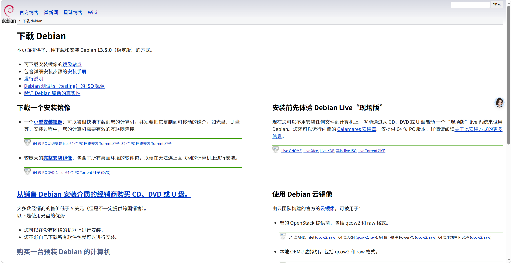
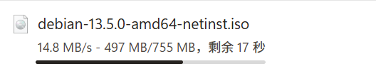
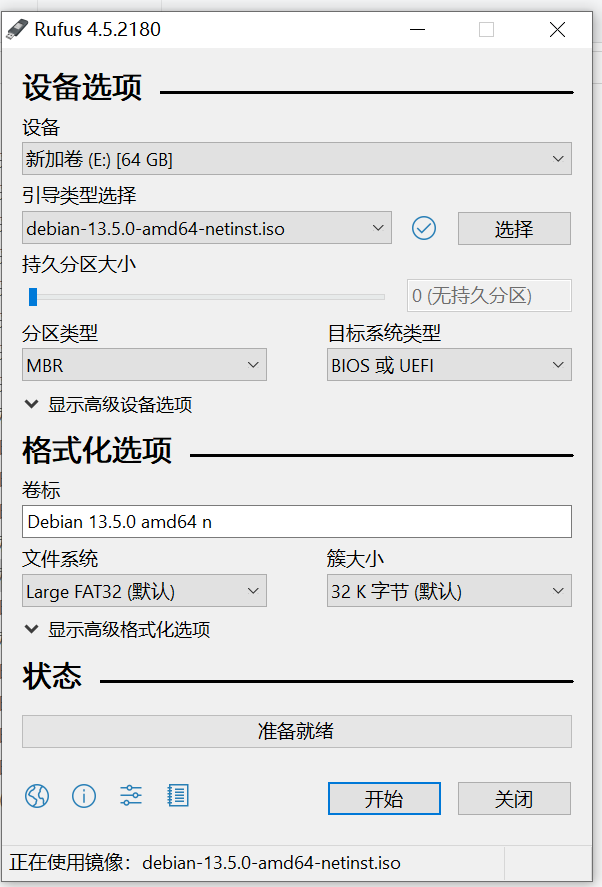

# Debian13安装教程

## 一. 下载Debian13ISO并烧录
1. 进入网站`https://www.debian.org/distrib/`
点击`64 位 PC 网络安装 iso`下载得到
2. 使用refus烧录到U盘
---

## 二. 通过U盘镜像安装Debian13
---

## 三. 配置系统
1. 添加`adorukw`到sudoers中
    ```
    su
    sudo usermod -aG sudo adorukw
    newgrp sudo
    ```
2. 下载Edge并安装，卸载火狐
    ```
    sudo apt purge firefox-esr
    sudo apt autoremove
    ```
3. 卸载各种软件，并整理软件文件夹
4. 调整tweak中的选项
5. 修改截图、打开终端、返回桌面快捷键
6. 安装vscode
7. 安装扩展

## 四. 安装常用软件
1. vim
2. fastfetch
    ```bash
    sudo apt install fastfetch
    fastfetch --gen-config
    vim ~/.config/fastfetch/config.jsonc
    ```
3. QQ
4. 微信
5. QQ音乐（启动命令修改为`Exec=/opt/qqmusic/qqmusic %U --no-sandbox`）
6. WPS
7. 腾讯会议
8. Zotero
9.  Trae
10. Godot
11. Xournal++
12. Calibre
---

## 五. 安装各种扩展
1. 解决`GnomeDesktop-3.0 GIR file not found`
    ```bash
    sudo apt update
    sudo apt install gir1.2-gnomedesktop-3.0
    ```

## 五. 配置开发环境
1. git
2. crul
    ```bash
    curl -O https://repo.anaconda.com/miniconda/Miniconda3-latest-Linux-x86_64.sh
    chmod +x Miniconda3-latest-Linux-x86_64.sh
    bash Miniconda3-latest-Linux-x86_64.sh
    source ~/.bashrc
    ```
3. nvm
    ```bash
    curl -o- https://raw.githubusercontent.com/nvm-sh/nvm/v0.40.3/install.sh | bash
    echo 'export NVM_NODEJS_ORG_MIRROR=https://npmmirror.com/mirrors/node' >> ~/.bashrc
    source ~/.bashrc
    nvm install --lts
    npm config set registry shturl.cc/h1m2scAYvkPovf7iiabR
    ```
4. gcc、gdb、cmake
    ```bash
    sudo apt install build-essential cmake gdb
    ```
