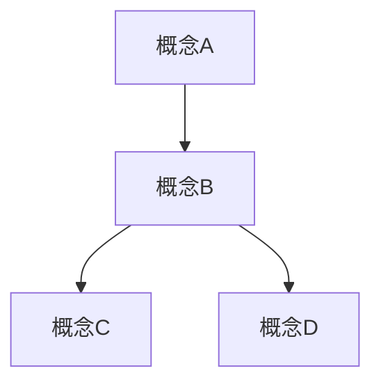

# Markdown 文档/教程编写模板

## 🎯 文档标题

> **文档说明**：简要描述本文档的目标读者、适用场景和主要内容

## 📋 目录
- #-概述
- #-快速开始
- #-核心概念
- #-详细用法
- #-最佳实践
- #-常见问题
- #-进阶技巧
- #-参考资料

---

## 📖 概述

### 什么是 [主题名称]？
[在这里用1-2段话简要介绍主题，说明其重要性和应用场景]

### 适用读者
- ✅ 适合：目标读者群体
- ❌ 不适合：不适用的情况

### 前置要求
- [ ] 基础知识1
- [ ] 软件/工具版本
- [ ] 其他前提条件

---

## 🚀 快速开始

### 安装/配置
```bash
# 基础安装命令
安装命令示例
```

### 最小示例
```语言类型
// 最简单的可运行示例
基础代码示例
```

### 验证安装
```bash
# 测试是否安装成功
验证命令
```

---

## 🎯 核心概念

### 基本架构


### 关键术语表
| 术语 | 解释 | 重要性 |
|------|------|--------|
| 术语1 | 详细说明 | ⭐⭐⭐ |
| 术语2 | 详细说明 | ⭐⭐ |

---

## 📚 详细用法

### 基础功能

#### 功能模块1
**用途**：描述这个功能的用途

**语法**：
```语言类型
代码示例
```

**参数说明**：
| 参数 | 类型 | 必填 | 说明 |
|------|------|------|------|
| `param1` | string | ✅ | 参数说明 |

**示例**：
```语言类型
实际使用示例
```

**注意事项**：
- ⚠️ 注意点1
- 💡 技巧1

### 进阶功能

#### 高级特性1
**适用场景**：什么时候使用这个特性

**配置步骤**：
1. 第一步
2. 第二步
3. 第三步

**代码示例**：
```语言类型
详细代码示例
```

---

## 💡 最佳实践

### 代码规范
```语言类型
// ✅ 推荐做法
推荐代码示例

// ❌ 避免做法
不推荐代码示例
```

### 项目结构
```
项目名称/
├── src/           # 源代码
├── docs/          # 文档
├── tests/         # 测试
└── config/        # 配置
```

### 性能优化
| 场景 | 问题 | 解决方案 | 效果 |
|------|------|----------|------|
| 场景1 | 问题描述 | 解决方法 | 提升XX% |

---

## ❓ 常见问题

### 安装问题
**Q：安装时出现错误 XXX**
**A**：解决方案说明
```bash
# 解决步骤
解决命令
```

**Q：依赖冲突怎么办？**
**A**：分步骤解决方案
1. 第一步
2. 第二步

### 使用问题
**Q：功能A不生效？**
**A**：排查步骤
- 检查点1
- 检查点2

### 错误代码表
| 错误代码 | 含义 | 解决方法 |
|----------|------|----------|
| ERR001 | 错误描述 | 解决步骤 |

---

## 🔧 进阶技巧

### 高级配置
```语言类型
// 高级配置示例
advanced_config = {
    option1: "value1",
    option2: "value2"
}
```

### 集成方案
#### 与工具A集成
```语言类型
// 集成代码
integration_example()
```

### 自定义扩展
**扩展点1**：如何扩展功能
```语言类型
// 扩展示例
custom_extension()
```

---

## 📊 实战案例

### 案例1：具体应用场景
**业务需求**：解决的问题描述

**解决方案**：
```语言类型
// 核心代码
solution_code()
```

**效果评估**：
- 指标1：提升XX%
- 指标2：减少XX%

### 案例2：复杂场景处理
**挑战**：遇到的困难

**解决思路**：思考过程

**最终方案**：
```语言类型
// 最终实现
final_solution()
```

---

## 🔍 调试与排错

### 日志分析
```bash
# 查看相关日志
tail -f /path/to/logfile
```

### 调试工具
| 工具 | 用途 | 命令示例 |
|------|------|----------|
| 工具1 | 用途描述 | `tool1 --option` |

### 性能分析
```bash
# 性能测试命令
performance_test --target=example
```

---

## 📈 版本更新

### 版本历史
| 版本 | 日期 | 主要更新 | 破坏性变更 |
|------|------|----------|------------|
| v1.0 | 2024-01-01 | 功能描述 | ❌ |

### 升级指南
**从 v1.x 升级到 v2.x**：
1. 备份步骤
2. 升级步骤
3. 验证步骤

---

## 📚 参考资料

### 官方文档
- https://example.com
- https://api.example.com

### 推荐阅读
- 📖 书籍名称 - 作者
- 🌐 博客文章标题 - 链接

### 相关工具
- 链接 - 工具描述
- 链接 - 插件功能

---

## 🎪 附录

### 命令速查表
```bash
# 常用命令1
command1 --help

# 常用命令2  
command2 --option
```

### 配置模板
```语言类型
# 完整配置示例
complete_config = {
    # 所有可配置项
}
```

### 许可证信息
本文档采用 [许可证名称] 许可证

---

## ✨ 贡献指南

### 报告问题
- [ ] 描述清晰的问题现象
- [ ] 提供复现步骤
- [ ] 附上相关日志

### 提交改进
1. Fork 项目
2. 创建功能分支
3. 提交更改
4. 创建 Pull Request

---

<div align="center">

**📞 需要帮助？**
链接 • 链接 • mailto:contact@example.com

*最后更新: 2024年1月1日*

</div>

---

## 🎯 使用说明

### 如何自定义这个模板

1. **替换占位符**：
   - 将 `[主题名称]` 替换为你的具体主题
   - 更新所有示例代码和命令
   - 修改目录结构适应你的内容

2. **内容组织**：
   - 保持层级清晰（2-3级标题为宜）
   - 每个章节保持焦点单一
   - 示例代码要可运行、可测试

3. **风格建议**：
   - 使用表情符号增强可读性
   - 重要内容使用**粗体**或`高亮`
   - 复杂流程使用图表说明

4. **版本控制**：
   - 为重大更新创建新版本章节
   - 维护变更日志
   - 标记过时内容

### 针对不同文档类型的调整建议

| 文档类型 | 重点章节 | 可省略章节 |
|----------|----------|------------|
| **入门教程** | 🚀 快速开始、📖 概述 | 🔧 进阶技巧、📊 实战案例 |
| **API文档** | 📚 详细用法、🔍 调试 | 🎯 核心概念、💡 最佳实践 |
| **故障排除** | ❓ 常见问题、🔍 调试 | 📖 概述、🎯 核心概念 |
| **项目文档** | 📋 目录、🚀 快速开始 | ❓ 常见问题、🔧 进阶技巧 |

这个模板的优势在于：
- **结构化**：逻辑清晰，便于查阅
- **实用性**：包含代码示例和实际场景
- **可扩展**：可以根据需要调整章节
- **美观性**：使用表情符号和格式化提升阅读体验

你可以根据具体需求删减或重组章节，但保持这种"概述→入门→详解→实战"的基本结构会让文档更加易用。